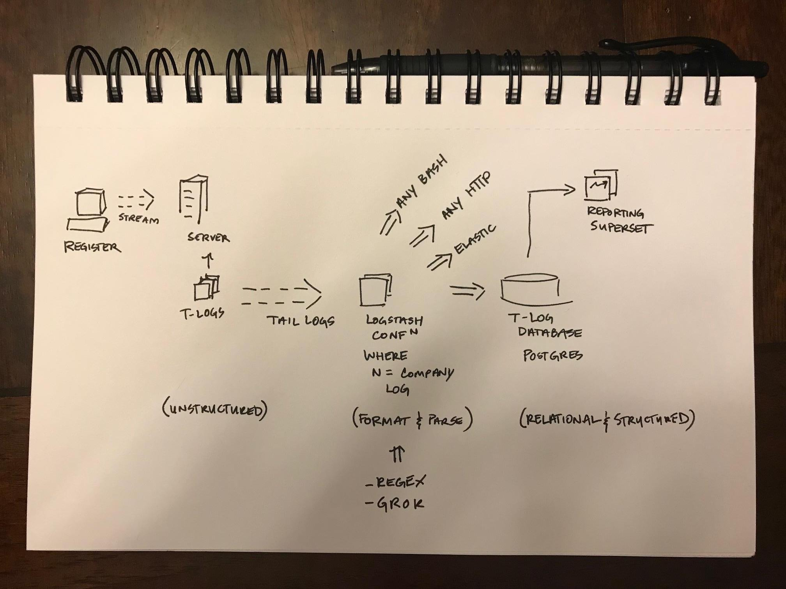

# log-parsing
general ideas/recommendation for log parsing

## Tools
I would recommend the following tools when log parsing for reporting, analytics, and additional processing:

- [Logstash](https://www.elastic.co/products/logstash): open source and flexible log parsing and streaming output with parse logic like regex, grok, etc. built with Ruby.
- [Superset](https://github.com/apache/incubator-superset): open source and highly flexible reporting platform.
- Postgres Database: postgres an open source relational database however has data types to allow for unstructured data storage.

## Diagram

